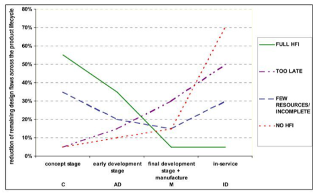
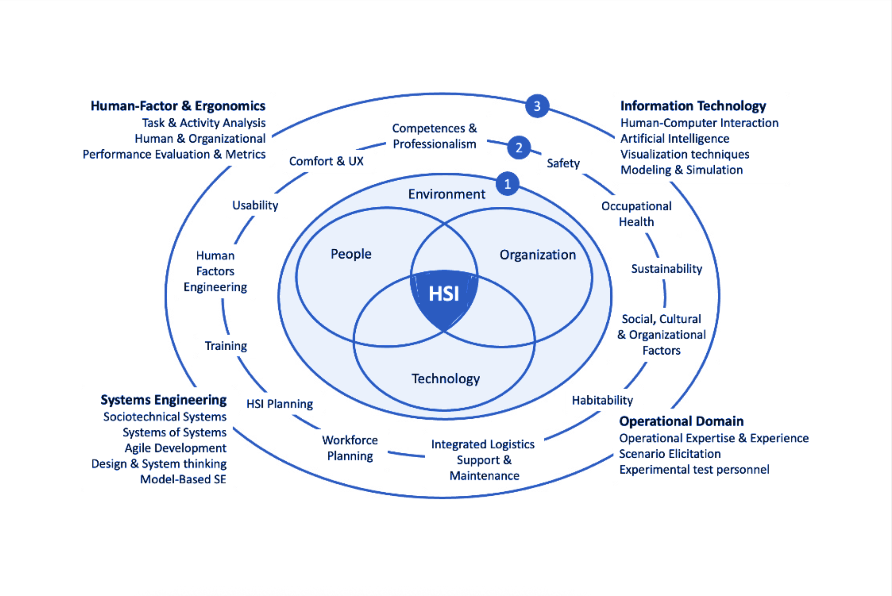
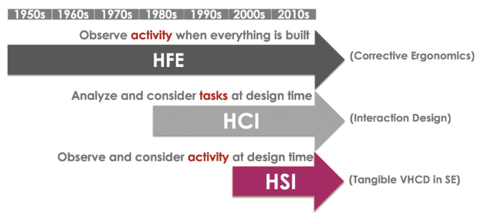
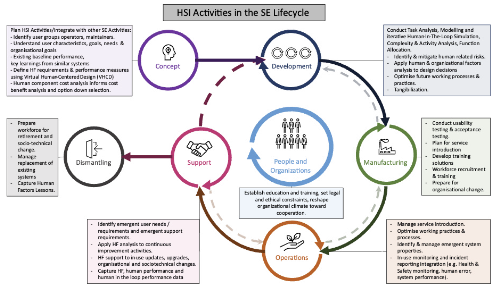

# Act 1 {background-color="#1C3A5E"}
## Every System Involves People {background-color="#1C3A5E"}

> Think of the last time a system technically worked — but operationally failed.

. . .

The checklist was too long. The interface confused the operator. The team was understaffed.
The environment was never considered. The maintenance crew wasn't trained for this.

. . .

**None of those are technology failures.**

They are **human-systems integration** failures.

::: {.notes}
Open with a provocation. Give the audience 5 seconds to think of their own example. This sets up the core message: HSI is not new work — it's the work you're already implicitly doing, but done systematically.
:::

---

## You Already Do This — Just Not Systematically

Most SE projects informally handle:

- Operator workload and procedures
- Training requirements
- Maintenance access
- Workforce planning

. . .

**HSI makes this explicit, rigorous, and lifecycle-wide.**

It is not a new bureaucratic layer on top of SE.
It is an integral part of SE — and it has a name.

---

## The Cost of Getting It Wrong

{fig-align="center"}

> Fixing human-related design issues late in the lifecycle costs **orders of magnitude more** than addressing them early.

*Source: HFI DTC/WP 2.7.2/3 (2009)*

::: {.notes}
Use the cost-of-change / HFI design flaw curve from Kennedy's deck (Slide 12).
Screenshot it as screenshot_fig_cost.png in the same folder as this .qmd.
:::

---

# Act 2 {background-color="#1C3A5E"}
## What is HSI? {background-color="#1C3A5E"}

---

## Definition

> **Human Systems Integration (HSI)** is the transdisciplinary sociotechnical and management *process* used to ensure that the human elements of a system are appropriately addressed and integrated within the wider systems engineering lifecycle.
>
> — *INCOSE SE Handbook, 5th Edition (2023)*

. . .

It integrates **Technology, Organisation, and People** — the **TOP Model** — within their **Environment**.

---

## The TOP Model

:::: {.columns}
::: {.column width="55%"}
| Entity | Examples |
|---|---|
| **T**echnology | Hardware, software, tools, interfaces |
| **O**rganisation | Processes, governance, culture, teams |
| **P**eople | Operators, maintainers, trainers, public |
| **Environment** | Physical, social, regulatory context |

Systems are **sociotechnical** — they always include all four.
:::
::: {.column width="45%"}
> "It is particularly important that systems are designed to meet human **capabilities, limitations, and goals**."
>
> — *HSI Primer Vol. 1*
:::
::::

---

## "Transdisciplinary" — What Does That Mean?

```
Disciplinary      →  Siloed
Multidisciplinary →  Summative    (disciplines work in parallel)
Interdisciplinary →  Interactions (disciplines inform each other)
Transdisciplinary →  Synthesis    (disciplines transform into something new)
                             ↑
                          That's HSI
```

. . .

No single discipline owns the human in a complex system.
**HSI synthesises across all of them.**

---

## The HSI Landscape

{fig-align="center"}

*Figure 1 — HSI Primer Vol. 1, p. 7*

Three contributing communities: **HF/Ergonomics · Information Technology · Systems Engineering**
Plus the **Operational Domain** at stake.

::: {.notes}
Screenshot Figure 1 from the Primer (p.7) — the three-circle diagram: TOP model at center,
13 HSI perspectives in the middle ring, contributing disciplines and operational domain in the outer ring.
Save as screenshot_fig_1.png in the same folder as this .qmd file.
:::

---

## A Brief History

{fig-align="center"}

*Figure 2 — HSI Primer Vol. 1, p. 13*

::: {.notes}
Screenshot Figure 2 from the Primer (p.13) — the three-arrow timeline:
HFE (corrective ergonomics) -> HCI (interaction design) -> HSI (tangible VHCD in SE).
Save as screenshot_fig_2.png.
:::

---

## From Fitting Humans to Technology — to the Reverse

| Era | Approach | Logic |
|---|---|---|
| Pre-1980s | **HFE** — observe activity *after* the system is built | Fit the human to the technology |
| 1980s | **HCI** — analyze tasks at design time | Fit the interface to the task |
| 1986+ | **MANPRINT** — formalise human aspects in US Army SE | Fit the technology to the human *system* |
| Today | **HSI** — observe & consider *activity* at design time, full lifecycle | Design systems that **allow humans to be humans** |

---

# Act 3 {background-color="#1C3A5E"}
## HSI in Practice {background-color="#1C3A5E"}

---

## HSI Across the SE Lifecycle

{fig-align="center"}

*Figure 3 — HSI Primer Vol. 1, p. 17*

::: {.notes}
Screenshot Figure 3 from the Primer (p.17) — circular SE lifecycle diagram:
Concept -> Development -> Manufacturing -> Operations -> Support -> Dismantling,
with People & Organizations at the center and phase-specific HSI activities around it.
Save as screenshot_fig_3.png.
:::

---

## What Happens in Each Phase

| Phase | Key HSI Activities |
|---|---|
| **Concept** | Identify users & impacts · HF requirements · CONOPS · baseline performance |
| **Development** | Task & activity analysis · HITL simulation · function allocation · risk mitigation |
| **Manufacturing** | Usability & acceptance testing · workforce recruitment & training · org. change prep |
| **Operations** | Service introduction · emergent property monitoring · incident reporting |
| **Support** | HF analysis for continuous improvement · in-use updates |
| **Dismantling** | Workforce retirement · sociotechnical change · capture lessons learned |

---

## Task vs. Activity — A Core HSI Distinction

**Task** = what is *prescribed* (the procedure, the checklist)

**Activity** = what is *effectively performed* (what people actually do)

. . .

> People adapt. Procedures drift. Unexpected events happen.

**HSI aims to close the gap** — by observing real activity, not just specifying tasks.

Key method: **Human-In-The-Loop (HITL) simulation** — test real human behaviour
against the system *before* it is built.

---

## Function Allocation

Who — or what — does each function: human or machine?

- Early allocation based on human capability frameworks (e.g. Fitts' MABA-MABA, 1951)
- **Incrementally revised** through HITL simulation as the design matures
- Must reflect *activity*, not just documented tasks

. . .

> This is where automation decisions live.
> And where they go wrong when HSI is absent.

---

## The 13 HSI Perspectives

:::: {.columns}
::: {.column width="50%"}
1. Human Factors Engineering
2. Social, Cultural & Organisational Factors
3. HSI Planning
4. Integrated Logistics Support / Maintenance
5. Workforce Planning
6. Competences / Professionalism
7. Training
:::
::: {.column width="50%"}
8. Safety
9. Occupational Health
10. Sustainability
11. Habitability
12. Usability
13. Comfort / UX
:::
::::

. . .

A **checklist of human considerations** — tailor to your project's nature and risk level.
None should be dismissed without a reason.

---

## Who Does HSI?

:::: {.columns}
::: {.column width="60%"}
The **Human Systems Integrator** coordinates across:

- HF/E specialists (usability, safety, health, training)
- Systems engineering team (lifecycle, MBSE, risk)
- Domain subject matter experts (operational expertise)

Practitioners arrive via: Human Factors · Systems Engineering ·
Psychology · Cognitive Science · Engineering disciplines
:::
::: {.column width="40%"}
> Few specialist degrees exist.
>
> Most HSI practitioners come via **non-traditional routes** — SE people trained in HF,
> or HF people embedded in SE projects.
:::
::::

---

## Tailoring HSI — Not One Size Fits All

Scale your HSI effort to:

- Complexity of human interaction with the system
- Novelty of the system and degree of automation
- Level of risk and safety criticality
- Degree of organisational change
- Resources available and mandated standards

. . .

> HSI must **coordinate** with SE activities throughout the lifecycle —
> not sit alongside them as an optional add-on.

---

# Act 4 {background-color="#1C3A5E"}
## Why It Matters for Your Organisation {background-color="#1C3A5E"}

---

## The Business Case for HSI

:::: {.columns}
::: {.column width="50%"}
**Performance**
Optimise the whole sociotechnical system — not just the hardware or software.

**Risk**
Catch human-related issues early. Safety incidents, health damage, and loss of life
are all HSI failures with legal, ethical, and financial consequences.
:::
::: {.column width="50%"}
**Cost**
Reduce lifecycle costs. Rework and operational failures are expensive.
Early HSI investment pays back.

**Time**
Reduce programme time overruns. Fewer surprises during test and operations.
:::
::::

. . .

**Organisationally:** HSI-aware workplaces show better employee performance,
reduced silos, and skills that transfer across project portfolios.

---

## The Three Levels of HSI Cost

1. Cost of **employing skilled HSI practitioners**
2. Cost of **implementing their recommendations** during development
3. Cost of **operations** once recommendations are — or are not — in place

. . .

> HSI is commonly seen as an *added* expense because developers
> don't always reap the operational benefits.

The adoption gap is real. **Making the value visible early is part of the HSI practitioner's job.**

---

## HSI Is Also an Ethical Commitment

> "Whatever notions or methods are implemented in a specific project,
> the final objective of HSI is **to design and to operate systems
> that allow humans to be humans**."
>
> — *HSI Primer Vol. 1*

. . .

Emerging pressures that make this urgent now:

- **AI and automation** — where does responsibility sit when the system fails?
- **Legal accountability** across the full system lifecycle
- **Societal and environmental impact** of the systems we build
- **Industry 4.0 / 5.0** — human-machine collaboration as a design goal, not a constraint

---

# Act 5 {background-color="#1C3A5E"}
## Join the Working Group {background-color="#1C3A5E"}

---

## The INCOSE HSI Working Group

**Mission:** Ensure all design and engineering disciplines include human and
sociotechnical integration to enable system performance.

:::: {.columns}
::: {.column width="50%"}
**~500 members** worldwide

Academia · Government · Industry

Aerospace · Space · Defence · Automotive ·
Transport · Telecoms · Healthcare
:::
::: {.column width="50%"}
**What the WG produces:**

- **HSI Primer** (5 volumes — Vol. 1 free on INCOSE portal)
- Contributions to the **INCOSE SE Handbook** (5th Ed.)
- Events, workshops, regional communities
- A growing body of HSI practice
:::
::::

---

## HSI WG Events — Past and Coming

| Year | Event |
|---|---|
| 2019 | 1st HSI International Conference |
| 2020–2022 | International Workshops |
| 2021 | 2nd HSI International Conference |
| 2023 | Regional Workshops — Biarritz · London · Virtual |
| 2024 | 3rd HSI International Conference — Jeju, South Korea |
| 2025 | 4th HSI WG International Workshop — Virtual |
| **2026** | **HSI WG Regional Workshops** *(add details)* |
| **2027** | **4th HSI International Conference** — alongside IEA Symposium *(add details)* |

---

## Coming Up — Save the Date

::: {.callout-important}
## Placeholder — fill in before the symposium

**HSI Workshop 2026**
Date · Location · Registration link

**HSI Conference 2027** — co-located with IEA Symposium
Date · Location · Call for papers / abstracts
:::

**WG General Meetings:** 3rd Wednesday of every other month (July · Sept · Nov)

All levels of contribution welcome: present, write, review, or simply show up.

---

## Connect With Us

| | |
|---|---|
| **Email** | hsi@incose.net |
| **LinkedIn** | linkedin.com/company/incose-hsi |
| **Community** | connect.incose.org |
| **YouTube** | youtube.com/@INCOSE_HSI_WG |
| **Free Primer Vol. 1** | INCOSE Member Portal |

. . .

> The HSI WG exists because no single discipline owns the human in a complex system.
>
> **We need systems engineers at the table — and that means you.**

---

## Summary

| | |
|---|---|
| **What** | Transdisciplinary SE approach — People, Technology, Organisation, Environment |
| **Why** | Performance · Risk · Cost · Time · Human well-being · Ethics |
| **When** | Whole lifecycle — concept through dismantling |
| **How** | HCD + HITL simulation + agile iteration + 13 perspectives |
| **Who** | HSI practitioners *alongside* SE teams, with users in the loop |
| **Ethic** | Design systems that **allow humans to be humans** |

. . .

**Start today:** Download HSI Primer Vol. 1 free from the INCOSE portal.
Come to a WG meeting. Bring a colleague.

---
